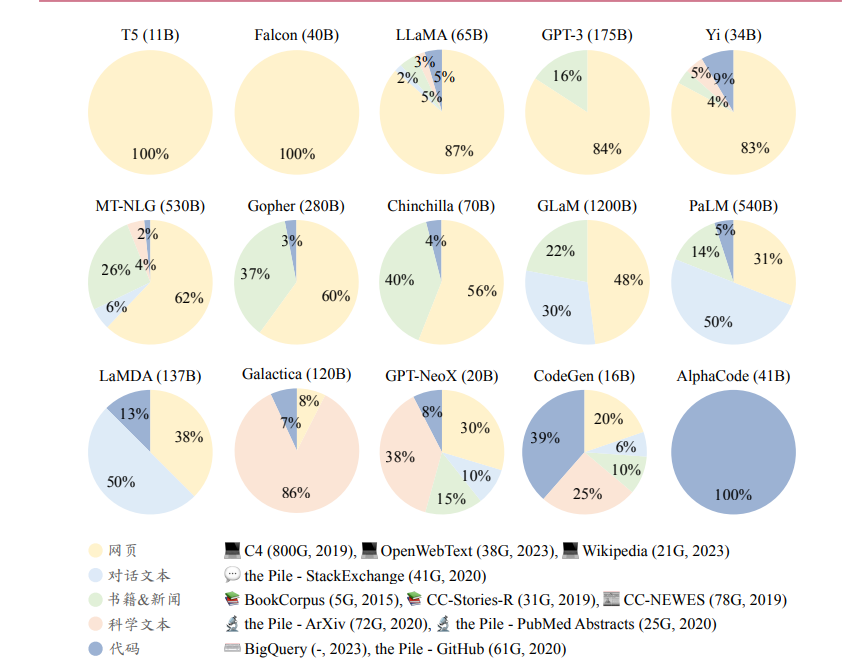

# LLM Survey

[https://github.com/RUCAIBox/LLMSurvey](https://github.com/RUCAIBox/LLMSurvey)

中文书： [https://llmbook-zh.github.io/](https://llmbook-zh.github.io/)

## LLM 构建过程

### 大规模预训练 pretrain

使用与下游任务无关的大规模数据进行模型参数的初
始训练，可以认为是为模型参数找到一个较好的“初值点”

### 指令微调 instruction fine-tuning / supervised fine-tuning

- 预训练模型（如BERT、GPT）通过海量文本学习了语言规律，但缺乏直接执行特定任务（如翻译、问答）的能力。
- **微调（Fine-tuning）** 是让模型适应具体任务的常见方法，但传统微调通常针对单一任务，灵活性有限。
- 使用**带指令的数据集**进行训练，每条数据包含：
    - **指令（Instruction）**：明确的任务描述（如“将以下句子翻译成英文”）。
    - **输入（Input）**：任务的具体内容（如待翻译的句子）。
    - **输出（Output）**：期望的正确答案。
- 目标是让模型学会**根据指令泛化到未见过的任务**，而不仅限于训练集中的特定任务。**模仿学习（Imitation Learning）**

### 对齐 Alignment

强化学习对齐方法 RLHF （Reinforcement Learning from Human Feedback）：

需要标注人员针对大语言模型所生成的多条输出进行偏好排序，并使用偏好数据训练奖励模型，用于判断模型的输出质量

## 扩展法则 scaling law

### KM scaling law

Kaplan 等人 [15]（OpenAI 团队）首次建立了神经语言模型性能与三个主要因素——模型规模（𝑁）、数据规模（𝐷）和计算算力（𝐶）之间的幂律关系

模型性能主要随计算量（C）、参数量（N）和数据量（D）的**同步增加**而提升，且优先扩大模型规模（N）是关键。

### Chinchilla scaling law

重新定义计算资源在模型参数量（N）与训练数据量（D）之间的最优分配

发现许多大模型（如 GPT-3）**未充分利用训练数据**，在相同计算预算下，通过**减少模型参数量（N）并大幅增加数据量（D）**，可以显著提升模型效率与性能。

$$
L(N,D) = E + \frac{A}{N^\alpha}+\frac{B}{D^\beta}
$$

𝐸 = 1.69, 𝐴 = 406.4, 𝐵 = 410.7，𝛼 = 0.34 和 𝛽 = 0.28

计算量（C）、参数量（N）和数据量（D）的平衡关系：

$$
C=6⋅N⋅D
$$

 **N 与 D 的最优比例为:**

$$
N∝C^{0.5},D∝C^{0.5}
$$

观点：**较小的模型+更多数据**的组合可能优于超大模型。

## 涌现

“在小型模型中不存在但在大模型中出现的能力”，具体是指当模型扩展到一定规模时，模型的
特定任务性能突然出现显著跃升的趋势，远超过随机水平

- 上下文学习（In-context Learning, ICL）
- 指令遵循（Instruction Following）
- 逐步推理（Step-by-step Reasoning）: chain-of-thougut, CoT

## 预训练

### 数据收集

数据库

### 数据预处理

质量过滤，敏感内容过滤，数据去重

### 词元化 tokenization

算法：BPE，wordpiece，unigram

### 模型架构

transformer, multi-head attention

### 预训练

## 指令微调

### 数据构建

**基于人工数据：**

- 基于NLP数据集
- InstructGPT：将用户提交给 OpenAI API 的查询作为任务描述
- 人工标注

**基于模型生成数据：**

- self-instruct
- evol-instruct: 深度/广度演化